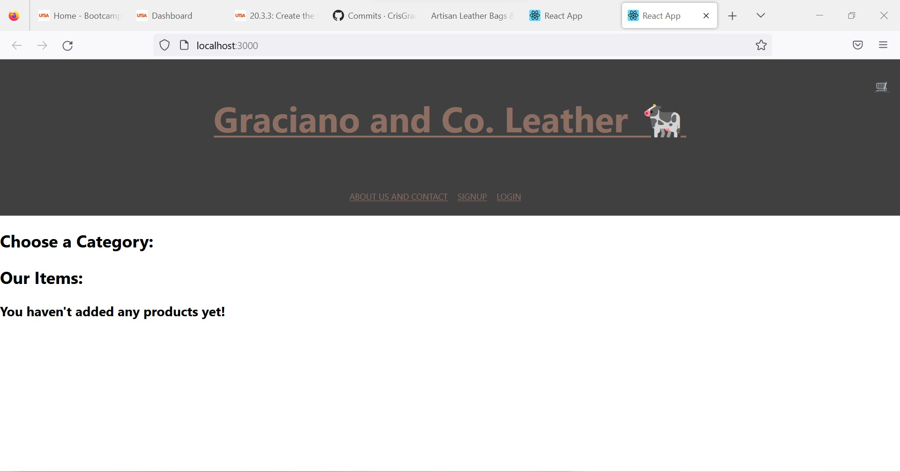
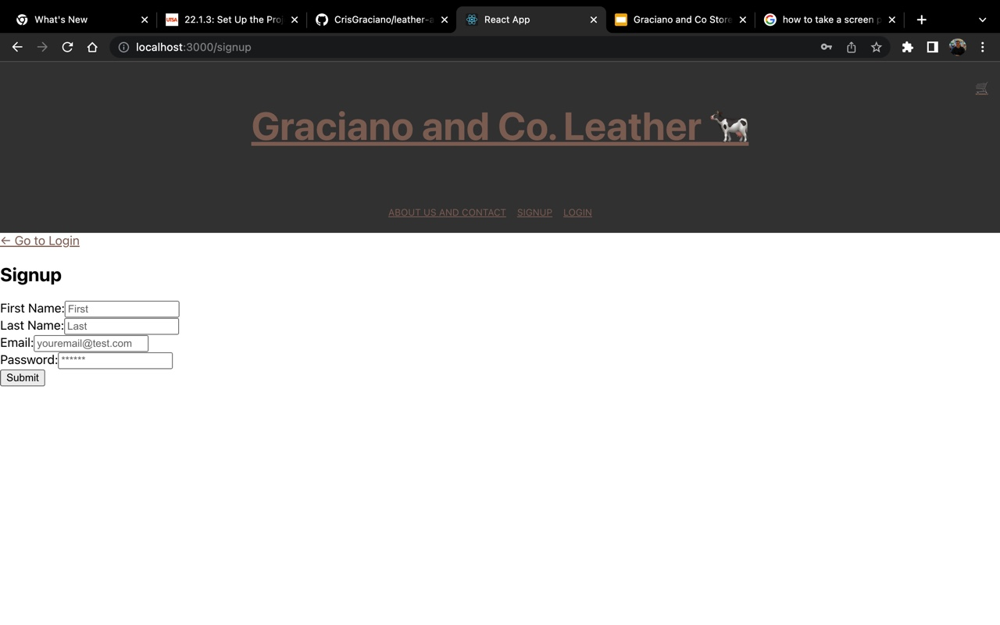
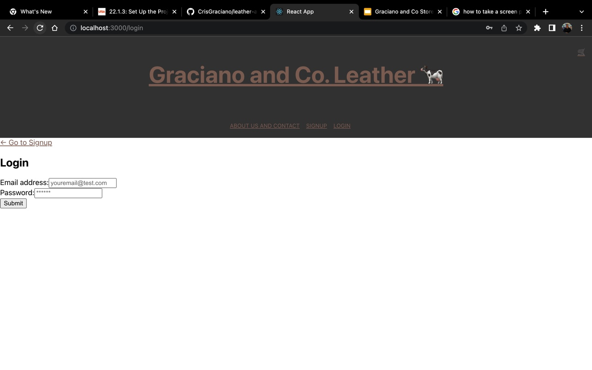

# Leather E-commerce Web App

## Description
This is an E-commerce appliaction built using the MERN Stack and deployed to Heroku. It is simple to use and allows users to create an account and order their chosen products. Once a product is chosen, it is sent into your shopping cart allowing you to order the items you selected. Items are also filtered by categories using the buttons on the top area of the Products page. This is an MVP made for our Final Project for the UTSA Coding Bootcamp.

## Technologies Used
This application is built using the MERN stack and uses Apollo Server. We have used React as our JavaScript Library, we have seeded our items on our Mongo Server. We are also using Express.js for our backend framework.

## Images

## Link to Deployed App
https://obscure-scrubland-89470.herokuapp.com/

## Usage
Deployed link to application above. No need for clones or installations.

## Contributions/ Contact
Priscilla Montalvo  
GitHub: https://github.com/edpris10  
Email: EdPris.Montalvo@gmail.com 
 
Cristobal Graciano  
GitHub: https://github.com/CrisGraciano  
Email: cristobalgraciano98@gmail.com  